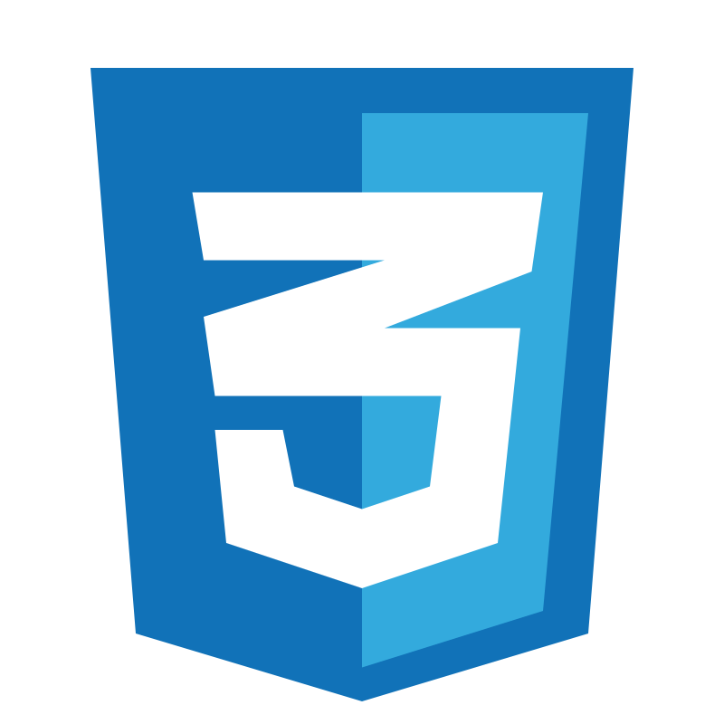

    

  🔹 <strong>Ingeniero de Sistemas | Backend Developer</strong>  
  🔹 Apasionado por el desarrollo de software y los datos 

  <h2><strong>🚀 Tecnologías & Herramientas 🚀</strong></h2>
  

    
    
    
    
    
    
    
    
    
    
    
    
    
  

  <h2><strong>📈 Estadísticas de GitHub</strong></h2>
   

  <h2><strong>🌐 Encuéntrame en</strong></h2>
  

  
  
  
  

  <h2><strong>📬 Contáctame</strong></h2>

<h2><strong>📧 Email <a href="mailto:juanddelgadoguerra@gmail.com">juanddelgadoguerra@gmail.com</a></strong></h2>

